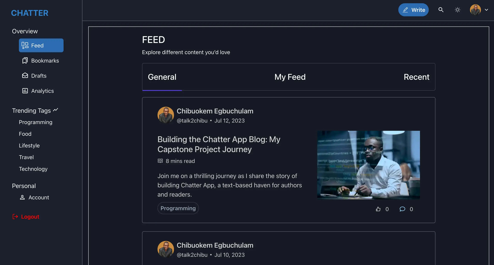

# Chatter - Blog App



## Project Overview

Chatter is a haven for text-based content enthusiasts, offering a multi-functional platform where authors and readers can create and access their own content. 

## Features

- **User Registration and Authentication**: Chatter allows users to register and create their own accounts on the platform. Users can sign up using their email address or social media accounts like Google.

- **Content Creation**: Chatter provides a rich text editor that allows users to create and publish their own content easily. Users can write blog posts or any other content, and add images or videos to enhance their content. The blog posts will be written and saved in Markdown, then it gets displayed as HTML when the posts are viewed.

- **Content Discovery**: Chatter provides a personalized feed based on the user's interests and reading history, making it easier for users to discover new content. Users can also browse and search for other users’ content. Users can explore different categories and tags to find content that interests them.

- **Social Features**: Chatter provides social features like commenting and liking that allow users to interact with each other and engage in discussions.

- **Analytics**: Chatter provides detailed analytics that allows users to track their content's performance. Users can see how many views, likes, and comments their content has received and how many users have bookmarked their content.

- **Published Posts**: Users can read published posts created by other users.

- **Author Profiles**: Users can view each author's profile, including their information and published posts.

- **Updating User Profiles**: Users can update their own profile information.

- **Bookmarking and Drafts**: Users can bookmark posts to save them for later. They can also save posts as drafts before publishing.

- **View Mode**: Users can switch between light and dark themes for a personalized experience.

## Technologies Used

- Next.js: The foundation of the application.
- Chakra UI: The UI component library for building the user interface.
- TypeScript: The programming language used to write type-safe code.
- React Hooks: A feature in React that allows functional components to use state and lifecycle methods.
- Context API: A feature in React that provides a way to share data across the component tree without prop drilling.
- Markdown: The format used for authoring blog posts.
- Firebase: The database used to store user information and content data

## Contributing

Contributions to Chatter - Blog App are welcome! If you want to contribute to the project, please follow these steps:

1. Fork the repository.
2. Create a new branch for your feature or bug fix.
3. Commit your changes and push them to your forked repository.
4. Submit a pull request describing your changes.

## Deployment

The application has been deployed using Vercel and can be found => [Chatter-blog](https://chatter-blog-opal.vercel.app/)

## Installation and Usage

To run the development server locally, follow these steps:

1. Clone the repository:

   ```bash
   git clone git@github.com:ebokes/chatter-blog.git
   ```

2. Install the dependencies:

   ```bash
   cd chatter-blog
   npm install
   ```

3. Start the development server:

   ```bash
   npm run dev
   ```

4. Open http://localhost:3000 in your browser to see the application.

## Resources

- [Next.js Documentation](https://nextjs.org/docs): Learn about Next.js features and API.
- [Chakra UI Documentation](https://chakra-ui.com/docs): Explore Chakra UI components and their usage.
- [React Markdown Documentation](https://www.npmjs.com/package/react-markdown): Reference for React Markdown library.
- [Firebase Documentation](https://firebase.google.com/docs): Learn about Firebase and its features for backend and database integration.

---

Happy reading and writing on Chatter! We hope you enjoy the platform and find it to be a true haven for text-based content.

```

```
